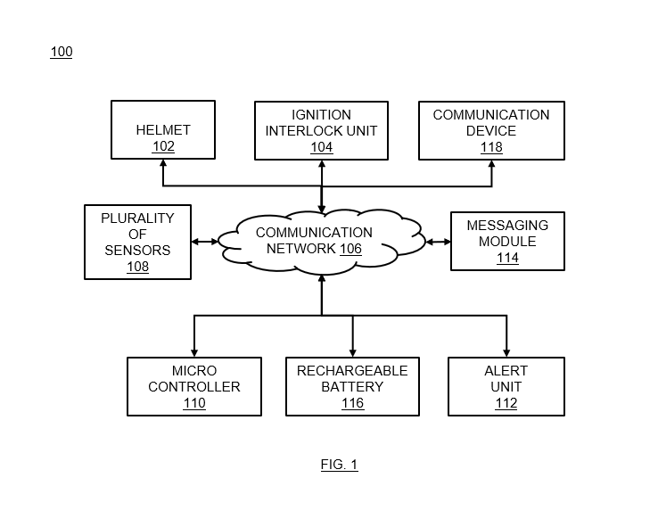
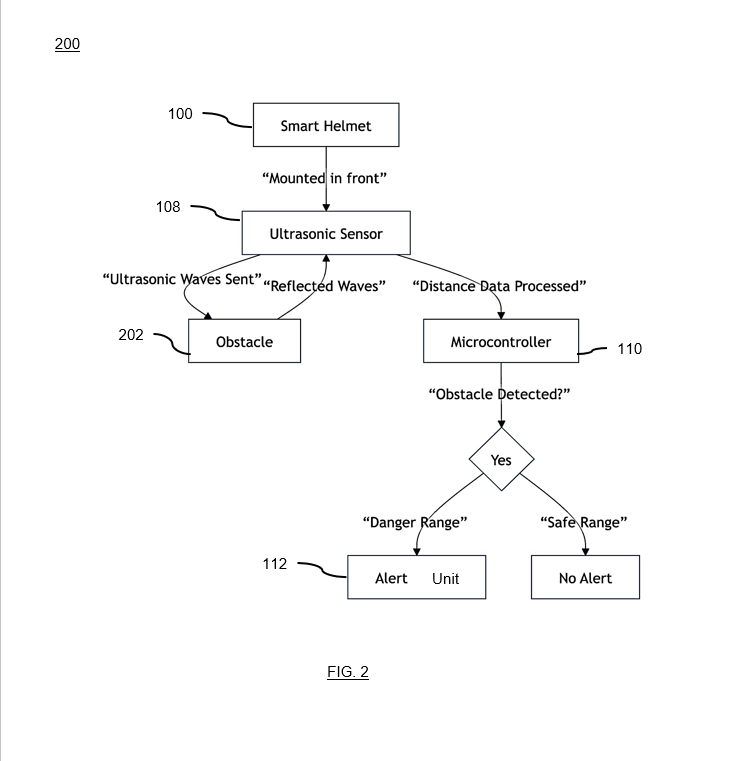

# ESP32 Smart Helmet System


An IoT-enabled Smart Helmet developed using ESP32 for collision detection, obstacle prevention, helmet enforcement, and automated emergency response.

---

# Project Overview

The ESP32 Smart Helmet is an intelligent rider-safety system designed to improve road safety using embedded systems and IoT technologies.

The system integrates:
- Helmet-wear verification
- Obstacle detection
- Collision monitoring
- Emergency communication
- GPS tracking
- Vehicle ignition interlock

The project focuses on preventive safety measures and automated emergency response mechanisms for transportation, logistics, and rider safety applications.

---

# Intellectual Property & Patent Publication

This project has been officially published as an Indian Patent Application for the proposed IoT-enabled Smart Helmet safety system.

## Patent Details

- **Title:** A SMART HELMET
- **Indian Patent Application No.:** 202511112600
- **Publication Date:** 02 January 2026
- **Publication Status:** Published in the Official Journal of Patents (India)
- **Patent Grant Status:** Pending / Not Yet Granted
- **Reference ID:** SURDC/P/25/11/775

## Patent Scope

The published patent application covers:
- Smart ignition interlock mechanism
- Helmet wear verification system
- IoT-based collision prevention
- GPS-enabled emergency response
- Rider safety monitoring architecture
- Automated accident alert system

This repository presents the implementation architecture, technical workflow, hardware design, and research concepts associated with the published patent application.

---

# Key Features

- Helmet Wear Detection
- Smart Ignition Lock System
- Collision Detection
- Obstacle Detection using Ultrasonic Sensors
- GPS Tracking
- Emergency SOS Alerts
- Audio & Visual Warning System
- Real-Time Monitoring
- IoT Communication Support
- Automated Emergency Response

---

# Novel Features

## Ignition Interlock Mechanism
The vehicle ignition remains disabled unless helmet usage is electronically verified.

## Three-Layer Safety Architecture
- Preventive hazard monitoring
- Collision detection and validation
- Mandatory helmet enforcement

## Emergency Automation
Real-time GPS-enabled emergency alerts are transmitted to emergency contacts and responders.

## Logistics & Transportation Safety
Designed to improve rider safety and reduce operational downtime in logistics and transportation environments.

---

# Technology Stack

## Hardware Components

- ESP32
- Ultrasonic Sensor
- PIR Sensor
- Accelerometer
- Gyroscope
- GPS Module
- GSM Module
- Rechargeable Battery
- Helmet Wear Detection Unit
- Buzzer

---

# Why ESP32?

ESP32 was selected because it provides:

- Built-in Wi-Fi & Bluetooth
- IoT connectivity support
- Real-time sensor communication
- Low power consumption
- High processing capability
- Wireless communication functionality

---

# System Workflow

Helmet Sensors → ESP32 → Sensor Data Processing → Hazard Detection → Alert System → Emergency Communication

---

# Working Principle

1. Helmet-wear verification is performed using sensor modules.
2. Vehicle ignition remains disabled until helmet usage is confirmed.
3. Ultrasonic and PIR sensors monitor nearby obstacles.
4. ESP32 processes sensor data in real time.
5. Audio and visual alerts warn the rider about dangerous situations.
6. Accelerometer and gyroscope detect crash events.
7. GPS and GSM modules transmit emergency alerts with location data.

---

# System Architecture



---

# Obstacle Detection Workflow



---

# Demo Video

https://www.youtube.com/watch?v=zvDv8e0Oc2g

---

# Repository Structure

```bash
esp32-smart-helmet/
│
├── README.md
├── LICENSE
│
├── Documentation/
│   ├── Smart_Helmet_Specification.pdf
│   └── Patent_Disclosure_Presentation.pdf
│
├── Patent/
│   ├── patent_publication_notice.jpg
│   └── patent_publication.pdf
│
├── Drawings/
│   ├── fig1_architecture.png
│   ├── fig2_flowchart.png
│   └── system_design.png
│
├── Images/
│   ├── prototype.jpg
│   ├── working_demo.jpg
│   ├── hardware_setup.jpg
│   └── smart_helmet.jpg
│
├── Demo/
│   └── demo_link.txt
│
└── Hardware/
    └── components_list.md
```

---

# Technical Advantages

- Improves rider safety
- Reduces emergency response time
- Enables automated accident response
- Supports smart fleet management systems
- Enhances transportation reliability
- Promotes helmet compliance and awareness

---

# Industrial Applicability

This system can be applied in:

- Transportation systems
- Logistics & delivery services
- Smart mobility solutions
- Fleet management systems
- Rider safety infrastructure
- IoT-enabled transportation ecosystems

---

# Prior Art & Research References

The project concept is supported by existing research in:
- AI-integrated smart helmet systems
- IoT-enabled rider safety solutions
- GPS-based emergency response systems
- Collision detection technologies

Research references are included in the patent disclosure presentation.

---

# Future Improvements

- AI-based collision prediction
- Cloud analytics dashboard
- Mobile application integration
- Voice assistant support
- Predictive fleet monitoring
- Computer vision integration
- Real-time health monitoring

---

# Patent Documents

Patent publication documents and disclosure materials are available in the `Patent/` folder.

---

# Note

The original implementation source code is currently unavailable. This repository focuses on the hardware architecture, patent disclosure, implementation methodology, IoT workflow, and technical design of the Smart Helmet project.

---

# Author

**Chirag Dadwal**  
Sharda University

---

# License

This project is licensed under the MIT License.
